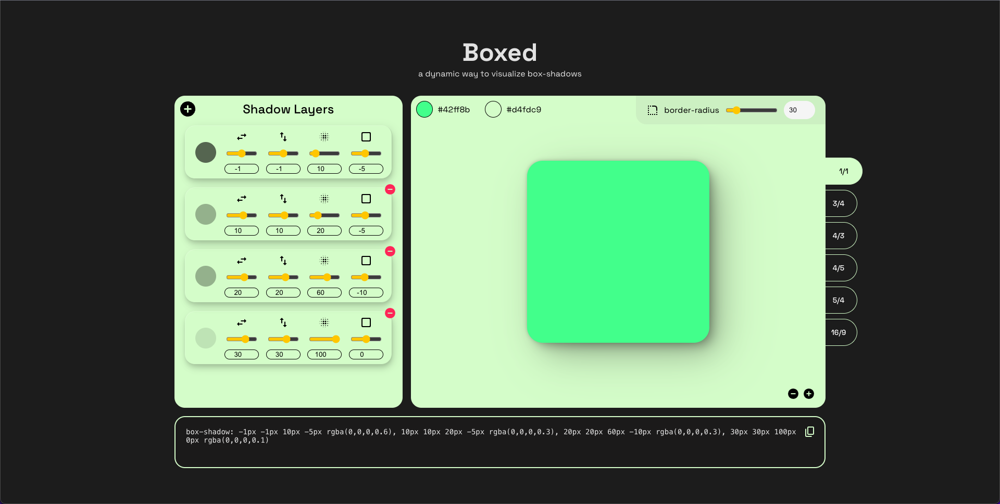

# Boxed

A playful way to visualize box-shadow(s)

Stack multiple box-shadows on top of eachother to create more realistic _or_ fun designs.

When you're satisfied with how your shadow looks, easily copy the css setting and incorporate it into your designs.

Preview: https://boxed-xi.vercel.app/

library used for shadow-color picker: https://github.com/omgovich/react-colorful

-Built by Ryan Milbourne
